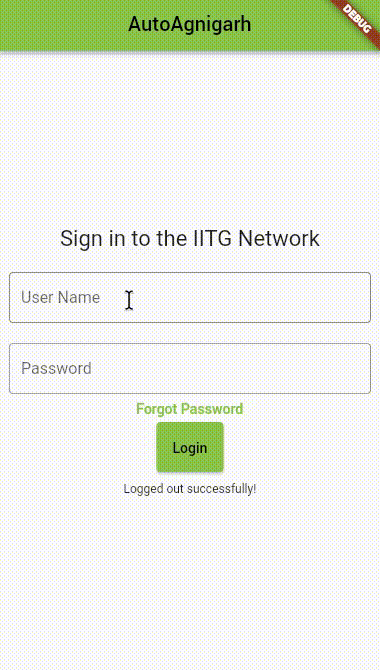

# AutoAgnigarh

An application to Auto login in IITG network to access internet through IITG Lan.


## Demo

<div align="center">
  
</div>

## Platfroms Supported

| Platform | Supported | Tested | Release 
| ---| --- | --- | --- |
| Android | ✅|✅|✅|
| iOS | ✅|⬜️|⬜️|
| Linux | ✅|✅|⬜️|
| Windows | ✅|⬜️|⬜️|
| MacOS | ⬜️|⬜️|⬜️|

## Installation

- ### Android
  - Download [apk release](https://github.com/SysSn13/AutoAgnigarh/releases/download/v1.0/autoagnigarh.apk) and install

## TODO

- Add IITG Authentication  ✅
- Add local storage for user credentials ✅
- Add installation steps ⬜️
- Build the app for iOS, Linux and Windows ⬜️
- Add backround running for android and iOS ⬜️ 


## Contributing

You can contribute by creating issues, feature/ pull requests. Any meaningful contributions you make are greatly appreciated.

For contributing in the source code, please follow these steps:

-   Fork the Project
-   Create your new Branch
    ```bash
    git checkout -b feature/AmazingFeature
    ```
-   Commit your Changes
    ```
    git commit -m 'Add some AmazingFeature'
    ```
-   Push to the Branch
    ```
    git push origin feature/AmazingFeature
    ```
-   Open a Pull Request
